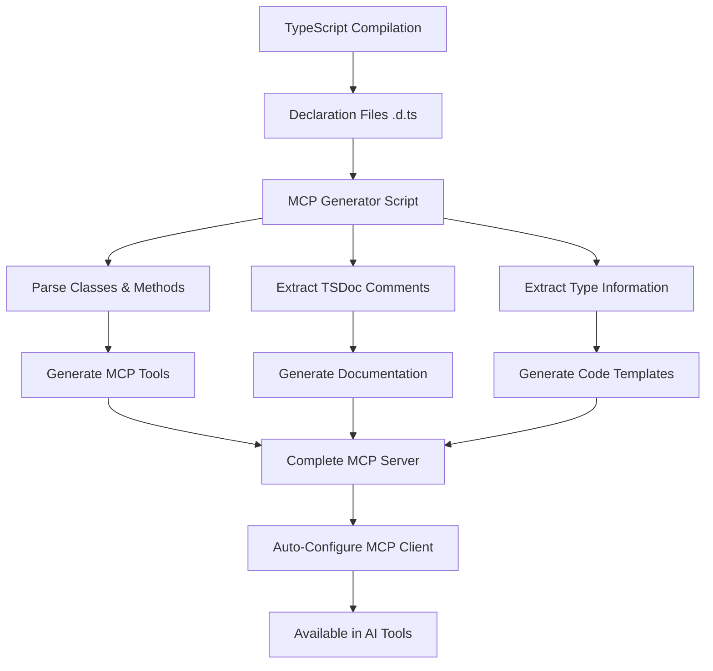

# AO JS SDK MCP Server Generation

This document describes the automated Model Context Protocol (MCP) server generation system that transforms the AO JS SDK into an MCP server for AI code assistance.

## Overview

The MCP server generation system automatically creates an MCP server that provides:
- **390+ Tools**: One for each public method across all SDK clients
- **Code Examples**: Auto-generated TypeScript code snippets
- **Documentation**: Integrated TSDoc comments and links
- **Cross-Platform**: Works on Windows, macOS, and Linux
- **Zero Maintenance**: Updates automatically with SDK changes

## Architecture



## Generated Components

### MCP Tools
Each public method from the SDK becomes an MCP tool:
- **Token Operations**: `tokens_aotoken_getbalance`, `tokens_aotoken_transfer`
- **Profile Management**: `bazar_profile_getprofileinfo`, `bazar_profile_transferasset`
- **RandAO Services**: `randao_random_createrequest`, `randao_providerstaking_stake`
- **Autonomous Finance**: `autonomous_botegaamm_getprice`, `pi_delegate_setdelegation`
- **Miscellaneous**: `miscellaneous_raffle_pullraffle`, `miscellaneous_sweepstakes_pullsweepstakes`

### MCP Resources
- `ao-sdk://reference/all`: Complete SDK client reference
- `ao-sdk://examples/all`: All code examples in one resource

## Usage

### Quick Setup
```bash
npm run setup:mcp
```

This single command:
1. Generates the MCP server from current SDK build
2. Builds the MCP server TypeScript project
3. Configures MCP client settings automatically
4. Provides platform-specific setup instructions

### Individual Commands
```bash
# Generate MCP server only
npm run generate:mcp

# Configure MCP client only  
npm run configure:mcp
```

### Manual Build
```bash
# Build the SDK first
npm run build

# Generate and setup MCP server
npm run setup:mcp
```

## Cross-Platform Support

### Directory Locations

**Server Installation:**
- Default: `~/.mcp/servers/ao-js-sdk-server/`
- Override: Set `MCP_SERVER_DIR` environment variable

**MCP Client Settings:**

**Windows:**
- VS Code MCP: `%APPDATA%/Code/User/globalStorage/kilocode.kilo-code/settings/mcp_settings.json`
- Claude Desktop: `%APPDATA%/Claude/claude_desktop_config.json`

**macOS:**
- VS Code MCP: `~/Library/Application Support/Code/User/globalStorage/kilocode.kilo-code/settings/mcp_settings.json`
- Claude Desktop: `~/Library/Application Support/Claude/claude_desktop_config.json`

**Linux:**
- VS Code MCP: `~/.config/Code/User/globalStorage/kilocode.kilo-code/settings/mcp_settings.json`
- Claude Desktop: `~/.config/Claude/claude_desktop_config.json`

### Environment Variables

```bash
# Override server directory
export MCP_SERVER_DIR="/custom/path/to/servers"

# Override settings file path
export MCP_SETTINGS_PATH="/custom/path/to/settings.json"
```

## Integration Points

### Build Process Integration
The MCP generation integrates with the existing SDK build pipeline:

```
1. tsc (TypeScript compilation)
2. tsc-alias (Path resolution)
3. inject-doc-links.js (Documentation links)
4. generate-mcp-server.js (MCP generation) ← NEW
```

### Automatic Updates
- MCP server regenerates whenever SDK builds
- New clients/methods automatically become MCP tools
- Documentation updates flow through automatically
- Type information stays in sync

## Generated MCP Server Structure

```
~/.mcp/servers/ao-js-sdk-server/
├── package.json          # Auto-generated dependencies
├── tsconfig.json         # TypeScript configuration
├── README.md            # Generated documentation
├── src/
│   └── index.ts         # Complete MCP server code
└── build/
    ├── index.js         # Compiled server executable
    └── index.d.ts       # Type definitions
```

## Technical Details

### Declaration File Parsing
The generator processes `.d.ts` files to extract:
- **Class Declarations**: `export declare class TokenClient`
- **Method Signatures**: Parameters and return types
- **TSDoc Comments**: `@category`, `@description`, documentation links
- **Type Information**: Used for parameter validation

### Tool Generation
Each method becomes an MCP tool with:
- **Unique Name**: `{category}_{client}_{method}`
- **Code Example**: Auto-generated TypeScript usage
- **Documentation**: Links to full SDK docs
- **Parameter Schema**: Extracted from method signature

### Client Detection
The system automatically detects:
- **Client Classes**: Classes ending in "Client" or "Service"
- **Token Classes**: Classes in `/tokens/` directory
- **Public Methods**: Non-private, non-internal methods

## Example Generated Tool

```typescript
server.tool(
  "tokens_aotoken_getbalance",
  {
    // Parameters extracted from method signature
  },
  async (params) => {
    const codeExample = generateCodeExample("AOToken", "getBalance", params);
    
    return {
      content: [{
        type: "text",
        text: `📋 **AOToken.getBalance**

**Description:** Get balance for AO token

**Category:** Tokens

**Code Example:**
\`\`\`typescript
import { AOToken } from 'ao-js-sdk';

const client = await AOToken.autoConfiguration();
const result = await client.getBalance();
\`\`\`

**Documentation:** https://randaolabs.github.io/ao-js-sdk/classes/AOToken.html
`
      }]
    };
  }
);
```

## Customization

### Adding Custom Tools
To add custom tools beyond auto-generation:
1. Modify [`scripts/generate-mcp-server.js`](scripts/generate-mcp-server.js:1)
2. Add custom tool generation in `generateAllTools()` method
3. Regenerate with `npm run generate:mcp`

### Filtering Methods
To exclude certain methods from MCP generation:
1. Edit the `extractMethods()` function
2. Add filtering logic in the method processing
3. Regenerate the server

### Custom Documentation
To customize generated documentation:
1. Modify the `generateCodeExample()` function
2. Update the `generateToolResponse()` function
3. Regenerate to apply changes

## Publishing Workflow

### SDK Release Integration
Add MCP generation to your CI/CD pipeline:

```yaml
# .github/workflows/release.yml
- name: Build SDK
  run: npm run build

- name: Generate MCP Server
  run: npm run generate:mcp

- name: Publish MCP Server
  run: |
    cd ~/.mcp/servers/ao-js-sdk-server
    npm publish
```

### Version Synchronization
The MCP server version automatically tracks the SDK version:
- MCP server includes SDK version in metadata
- Generated tools reference current SDK documentation
- Build timestamps track generation time

## Troubleshooting

### Common Issues

**MCP Server Not Found:**
```bash
# Ensure SDK is built first
npm run build

# Regenerate MCP server
npm run generate:mcp
```

**Build Failures:**
```bash
# Check TypeScript compilation
cd ~/.mcp/servers/ao-js-sdk-server
npm run build
```

**Settings Not Applied:**
- Restart your IDE/editor after configuration
- Check MCP client is properly installed
- Verify settings file path for your platform

### Debug Mode
Enable verbose logging:
```bash
# Set debug environment variable
export DEBUG=mcp:*

# Run with debugging
npm run setup:mcp
```

### Manual Configuration
If automatic configuration fails, manually add to your MCP settings:

```json
{
  "mcpServers": {
    "ao-js-sdk": {
      "command": "node",
      "args": ["/path/to/.mcp/servers/ao-js-sdk-server/build/index.js"],
      "disabled": false,
      "alwaysAllow": [],
      "disabledTools": []
    }
  }
}
```

## Benefits

### For Developers
- **Instant Code Examples**: Generate correct SDK usage patterns
- **Type Safety**: Examples use actual TypeScript types
- **Complete Coverage**: Every client and method available
- **Always Updated**: Never goes out of sync with SDK

### For AI Models
- **Rich Context**: Full SDK structure and capabilities
- **Code Generation**: Proper usage patterns and examples
- **Documentation Access**: Links to complete API documentation
- **Best Practices**: Examples follow SDK conventions

## Future Enhancements

- **Parameter Extraction**: Parse method parameters for better tool schemas
- **Error Handling**: Include common error patterns in examples
- **Advanced Templates**: Generate complex usage scenarios
- **Interactive Exploration**: Tools for discovering SDK capabilities
- **Testing Integration**: Generate test examples alongside code

---

*This documentation is automatically maintained and updates with each SDK release.*